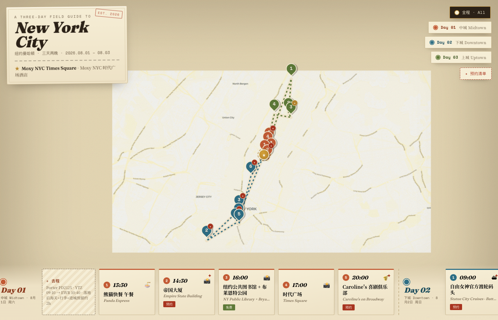

# NYC · 三日行程手绘地图 🗽

一个可交互的纽约曼哈顿三日行程地图（2026.08.01 – 08.03），复古旅行手账风格。基于 **React + Leaflet** 真实地理位置渲染，瓦片经做旧滤镜处理成泛黄旧地图的质感。



## 核心功能

- **真实地图路线** — 三天路线按天分色（Day1 赤陶橙 / Day2 褪色青 / Day3 橄榄绿），酒店为星标起终点
- **按天筛选** — 点顶部 chip 只看某一天，其余路线与站点淡化，地图自动框住当天范围
- **站点详情** — 点地图图钉或底部卡片，弹出详情：时间、中英双语名称、备注、是否需预约
- **预约区分** — 需预约的站点带红色"蜡封"徽记（图钉 + 卡片双重标识）
- **预约清单抽屉** — 按紧急程度列出所有需提前订的项目
- **底部横向站点条** — 手机端方便点按，含每天的航班"车票"信息
- **响应式** — 桌面 / 手机自适应

## 技术栈

- React 18 + Vite
- react-leaflet / Leaflet（CartoDB Voyager 免密钥瓦片 + CSS 做旧滤镜）
- framer-motion（卡片入场动效）
- 字体：Fraunces（展示衬线）/ Space Mono（标签）/ Noto Serif SC（中文）

> 无需任何地图 API key 即可运行。

## 本地开发

```bash
npm install
npm run dev      # 开发服务器
npm run build    # 生产构建 → dist/
npm run preview  # 预览构建产物
```

## 修改行程

所有行程数据集中在 `src/data.js`：`HOTEL`（酒店）、`DAYS`（每天的站点、坐标、备注、预约需求）、`BOOKING_LIST`（预约清单）。改这一个文件即可。
